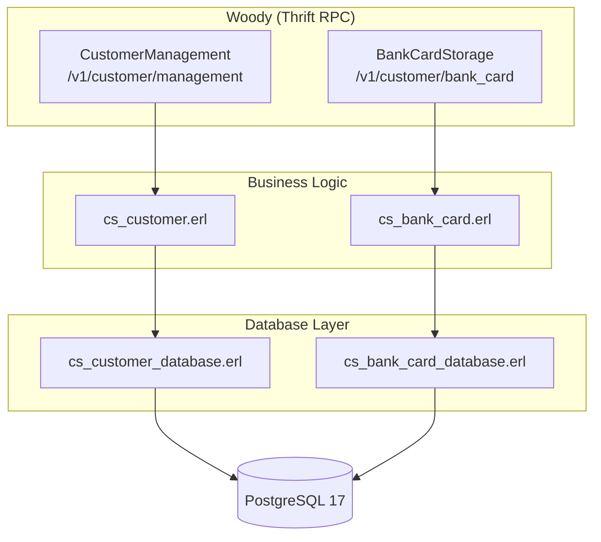
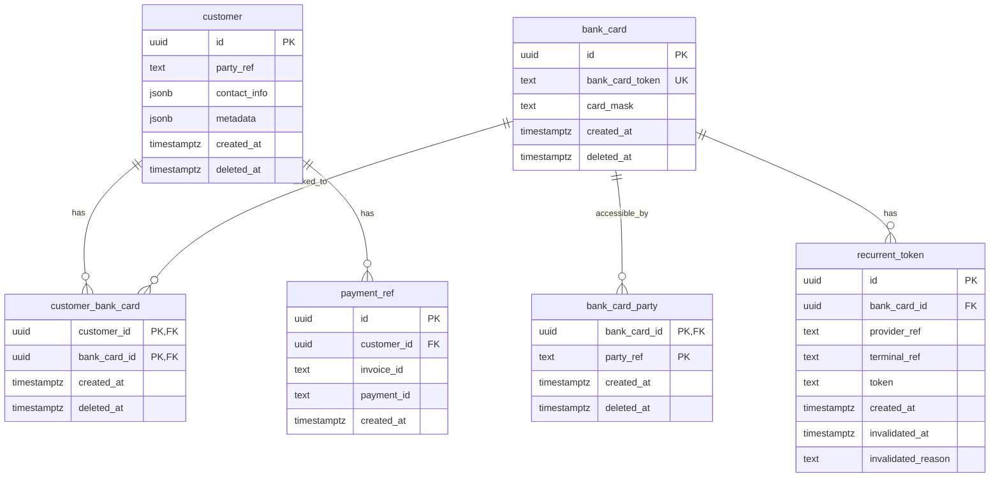

# cubasty

**CU**stomer **BA**nkcard **ST**orage (**Y**eah!) - an Erlang/OTP service for managing customers and their bank cards with recurrent payment token support. It provides Thrift RPC APIs for customer management and bank card operations.

## Features

- **Customer Management**: Create, get, delete customers with metadata and contact info
- **Bank Card Storage**: Store and manage bank cards linked to customers
- **Recurrent Tokens**: Store payment provider tokens for recurring payments
- **Multi-Party Support**: Bank cards can be shared across multiple parties
- **Soft Deletes**: All deletions are soft, preserving historical data

## Architecture



## Requirements

- Erlang/OTP 28+
- PostgreSQL 17
- Docker and Docker Compose (for development)

## Quick Start

### Development with Docker

```bash
# Start the development environment
docker compose up -d

# Run a shell inside the container
make wc-shell

# Or run specific commands
make wc-compile
make wc-test
```

### Running Checks

```bash
# All checks
make wc-compile && make wc-lint && make wc-xref && make wc-dialyze && make wc-eqwalizer

# Individual checks
make wc-check-format  # Check code formatting
make wc-format        # Auto-format code
make wc-lint          # Elvis linter
make wc-xref          # Cross-reference analysis
make wc-dialyze       # Dialyzer type analysis
make wc-eqwalizer     # EqWAlizer type checking

# Tests (wdeps-* starts PostgreSQL via docker compose)
make wdeps-eunit         # Unit tests
make wdeps-common-test   # Integration tests
make wdeps-test          # All tests
```

### Building a Release

```bash
make wc-release
```

## API Endpoints

| Endpoint | Service | Description |
|----------|---------|-------------|
| `/v1/customer/management` | CustomerManagement | Customer CRUD operations |
| `/v1/customer/bank_card` | BankCardStorage | Bank card and token operations |
| `/health` | - | Health check endpoint |
| `/metrics` | - | Prometheus metrics |

## CustomerManagement API

| Method | Description |
|--------|-------------|
| `Create(CustomerParams)` | Create a new customer |
| `Get(CustomerId)` | Get customer with linked cards and payments |
| `GetByParentPayment(InvoiceId, PaymentId)` | Find customer by payment reference |
| `Delete(CustomerId)` | Soft-delete a customer |
| `AddBankCard(CustomerId, BankCardParams)` | Link a bank card to customer |
| `RemoveBankCard(CustomerId, BankCardId)` | Unlink a bank card |
| `GetBankCards(CustomerId, Limit, ContinuationToken)` | List customer's bank cards |
| `AddPayment(CustomerId, PaymentRef)` | Add payment reference |
| `GetPayments(CustomerId, Limit, ContinuationToken)` | List customer's payments |

## BankCardStorage API

| Method | Description |
|--------|-------------|
| `Get(BankCardId)` | Get bank card with recurrent tokens |
| `Find(BankCardSearchParams)` | Find bank card by token and party |
| `Create(PartyRef, BankCardParams)` | Create a new bank card |
| `GetRecurrentTokens(BankCardId)` | List recurrent tokens |
| `AddRecurrentToken(RecurrentTokenParams)` | Add a recurrent token |
| `InvalidateRecurrentToken(...)` | Invalidate a recurrent token |

## Database Schema



See [migrations/001-init.sql](migrations/001-init.sql) for the full schema.

## Configuration

Configuration is managed via `config/sys.config`:

```erlang
{cs, [
    {ip, "::"},
    {port, 8023},
    {default_woody_handling_timeout, 30000}
]}
```

Database connection is configured via `epg_connector`:

```erlang
{epg_connector, [
    {databases, #{
        cs => #{
            host => "cs_db",
            port => 5432,
            database => "customer_storage"
        }
    }}
]}
```

## Project Structure

```text
apps/cs/
├── src/
│   ├── cs_app.erl              # Application callback
│   ├── cs_sup.erl              # Supervisor
│   ├── cs_customer_handler.erl # CustomerManagement Thrift handler
│   ├── cs_bank_card_handler.erl# BankCardStorage Thrift handler
│   ├── cs_customer.erl         # Customer business logic
│   ├── cs_bank_card.erl        # Bank card business logic
│   ├── cs_customer_database.erl# Customer DB operations
│   ├── cs_bank_card_database.erl# Bank card DB operations
│   ├── cs_mapper.erl           # Thrift <-> Erlang mapping
│   ├── cs_pagination.erl       # Pagination token encoding
│   ├── cs_json.erl             # JSON <-> Thrift conversion
│   └── cs_db_migration.erl     # Database migration utility
├── include/
└── test/
    ├── cs_integration_SUITE.erl
    ├── cs_ct_helper.erl
    └── cs_client.erl
```

## License

Apache-2.0
